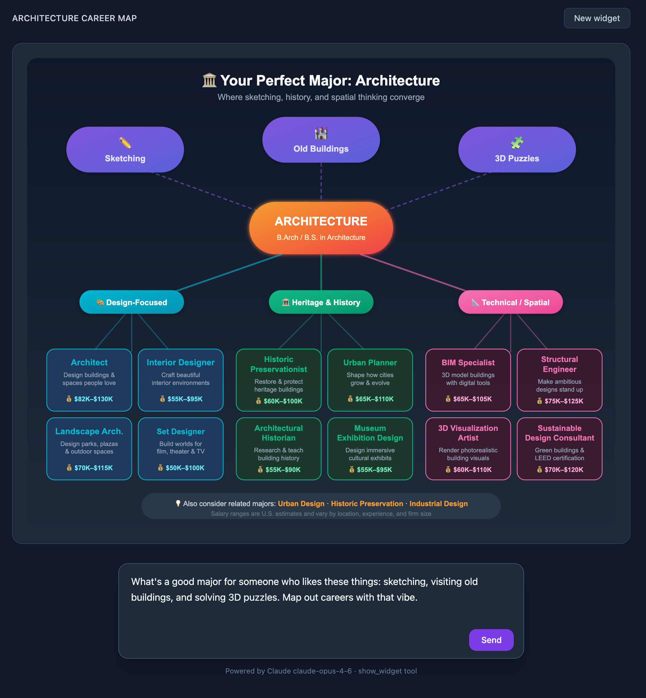
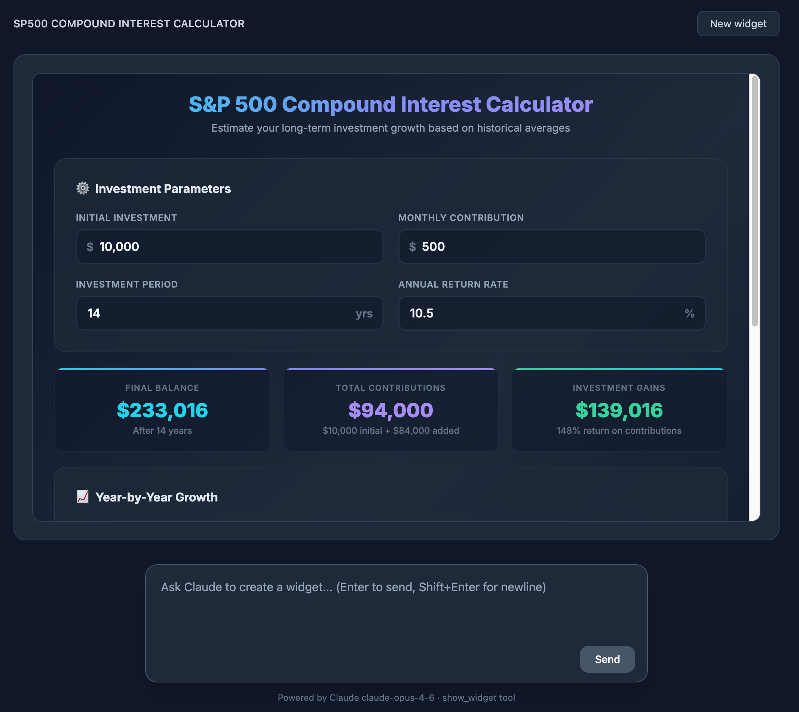
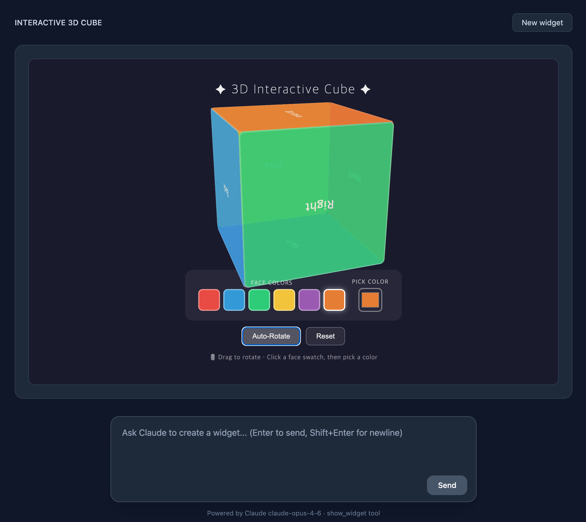
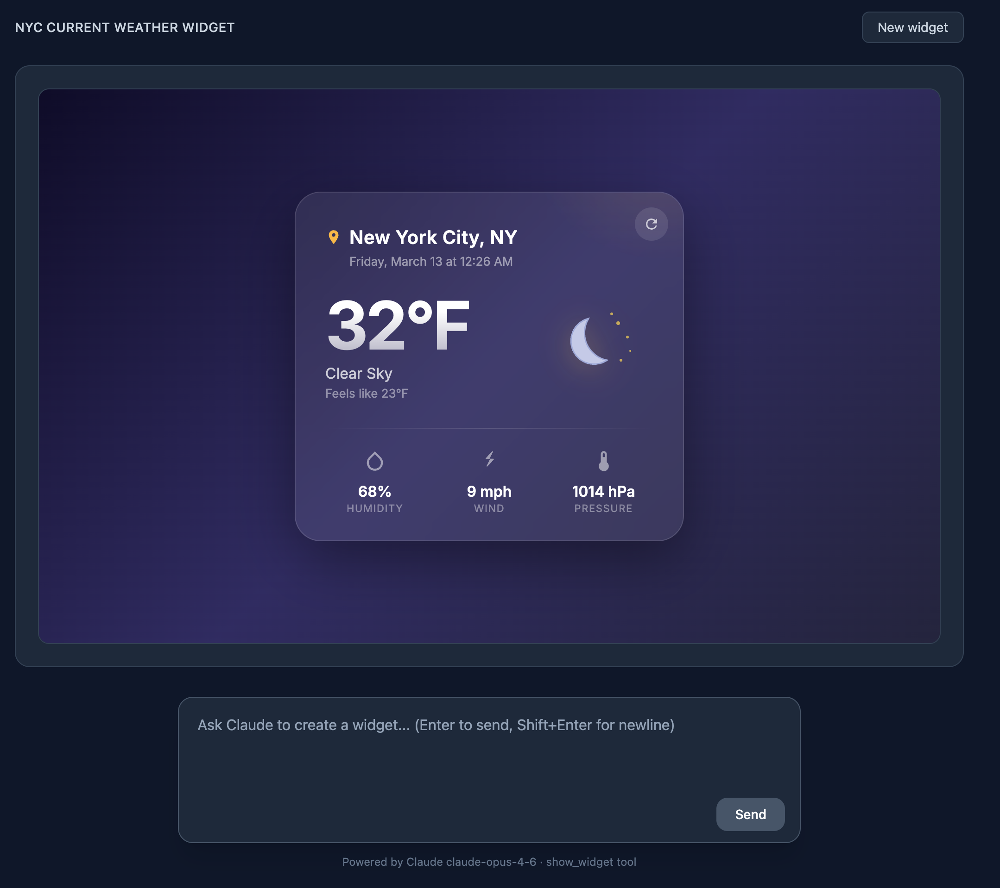

# Claude Widget

> Inspired by and built from analysis of this video: [https://www.youtube.com/watch?v=Ii99RU3mOJM](https://www.youtube.com/watch?v=Ii99RU3mOJM)

A full-stack app that lets Claude generate interactive SVG/HTML widgets in real time — streamed live as Claude thinks.

## DEMO

> Prompt: What's a good major for someone who likes these things: sketching, visiting old buildings, and solving 3D puzzles. Map out careers with that vibe.
> 

> Prompt:   Build an S&P 500 compound interest calculator.Inputs: initial investment, monthly contribution, years, annual return rate (default 10.5%).Show final amount, total contributions, and total gains.Add a year-by-year growth chart.  
> 

> Prompt: Show me a 3D cube that I can rotate and change colors on.
> 

> Prompt: Create a widget that shows the current weather in New York City, including temperature, conditions, and an icon.
> 
---

## How it works

1. Type a prompt describing what you want visualized
2. Claude streams a `show_widget` tool call (SVG or HTML) back to the browser
3. Loading messages appear while Claude is thinking — extracted live from the stream
4. The finished widget renders inline once streaming is complete

---

## Stack

| Layer | Tech |
|---|---|
| Backend | NestJS · Anthropic SDK (claude-opus-4-6) |
| Frontend | React 18 · Vite · TypeScript · Tailwind CSS |
| Streaming | SSE over `fetch` + `ReadableStream` |
| Monorepo | pnpm workspaces |

---

## Project structure

```
claude-widget/
├── backend/               # NestJS API
│   └── src/
│       └── widget/
│           ├── widget.controller.ts   # POST /widget/stream → SSE
│           └── widget.service.ts      # Anthropic streaming + tool parsing
└── frontend/              # React + Vite
    └── src/
        ├── hooks/
        │   └── useWidgetStream.ts     # SSE state machine
        └── components/
            ├── ChatInput.tsx          # Prompt input
            ├── LoadingDisplay.tsx     # Animated loading messages
            └── WidgetRenderer.tsx     # SVG / iframe renderer
```

---

## Getting started

### 1. Install dependencies

```bash
pnpm install
```

### 2. Configure API key

```bash
cp backend/.env.example backend/.env
# Edit backend/.env and set your key:
# ANTHROPIC_API_KEY=sk-ant-...
```

### 3. Run

```bash
# Terminal 1 — backend (http://localhost:3000)
cd backend && pnpm start:dev

# Terminal 2 — frontend (http://localhost:5173)
cd frontend && pnpm dev
```

---

## Widget rendering

Claude's `show_widget` tool output is auto-detected:

- Starts with `<svg` → rendered directly as inline SVG
- Otherwise → rendered in a sandboxed `<iframe srcdoc>` as HTML

Widgets can call `sendPrompt(text)` to send a follow-up message back to chat via `postMessage`.
